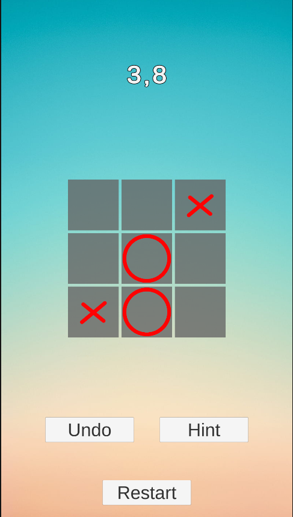
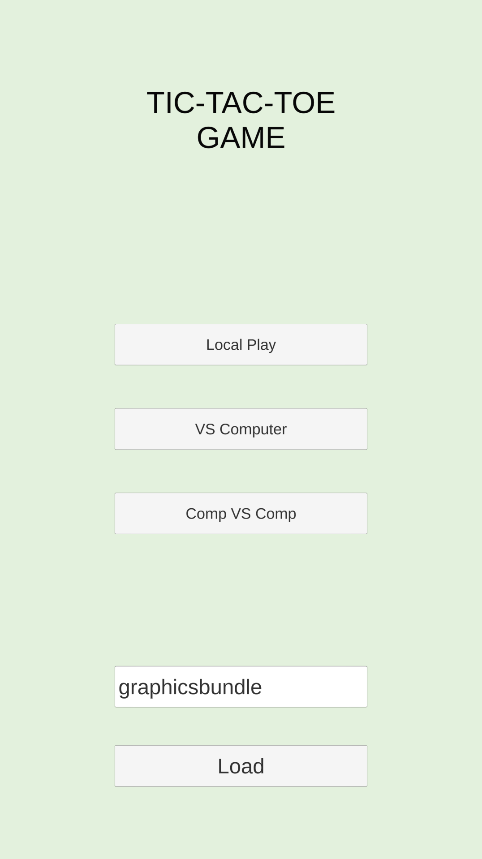
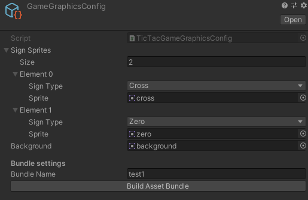

# Tic-Tac Game #

Here you can find an impementation of TicTacToe game. 
This is a game for two
players - X and - O, who take turns marking the spaces in a 3×3 grid. The player who
succeeds in placing three of their marks in a horizontal, vertical, or diagonal row is
the winner.

### Features of implementation ###

#### Base game ####
1. 3 x 3 grid size;
2. The game has 2 players, each will be assigned with X or O;
3. The players will take turns marking one empty square of the grid with their
symbol - X goes first;
4. Time limit - each turn will have a time limit (default of 5 seconds). If a player is
out of time he loses the game;
5. The game will end when one of the players will create a winning formation, a
player runs out of time or the board is full;
6. Hint Button - Suggest a next valid move for the player (random);
7. Undo Button - Undo the previous round (computer and player last turn). Undo
usages will be unlimited, and we will be able to undo back to the beginning of
the game;
8. Restart Game Button - restarts the game and randomly reassigns X/O to the
players;
9. At the end of the game, a message will appear (“Player 1 wins”, “Player 2
wins” or “Draw”).

The game is implemented to support the following modes:
● Player 1 vs Player 2 (local multiplayer) - 2 players playing on the same
device;
● Player vs Computer (Random move).

#### Unit Tests ####
Unit tests that cover the following:
● Hint
● Undo
● Win
● Lose
● Draw

#### Asset Bundles and Editor Tool ####
EditorWindow in which we can define and assign the following:
● X symbol (graphics)
● O symbol (graphics)
● Background (graphics)
● Asset bundle name (text)
● Build asset bundle (button)

Pressing the “build” button will trigger the creation of an Asset Bundle with all of the
content assigned above and will save the asset bundle to the Streaming Assets
folder.

#### Menu ####
The game have a “Main Menu” with the following options:
1. Choose play mode (player1 vs player 2 / player vs computer);
2. “Reskin” button + Text Box. When clicking reskin, we are trying to load the asset bundle
with the name from the text box and replace the game graphics;

* Unity version: `2019.4.18f1`.

